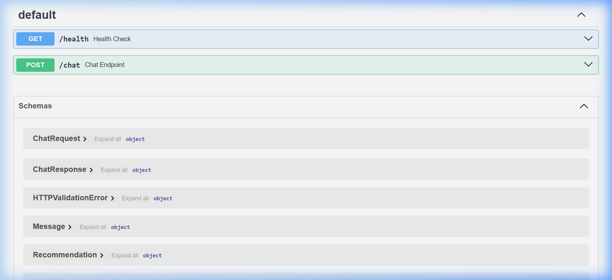

# 🤖 SHL Assessment Recommender API 🚀

Welcome to the **Conversational SHL Assessment Recommender**! This is a state-of-the-art FastAPI service designed to act as an intelligent dialogue agent. It helps recruiters and hiring managers find the perfect SHL assessments for their needs.

---

## ✨ Features

- 🗣️ **Conversational Interface**: Handles natural dialogue, clarifying questions, and refinement.
- 🎯 **Grounded Recommendations**: Strictly uses the SHL catalog data without hallucinating.
- 📊 **Comparison Capability**: Can explain differences between assessments (e.g., OPQ vs GSA).
- 🔒 **Out-of-Scope Guardrails**: Refuses general advice or prompt injections.
- ⚡ **Stateless & Fast**: Fast response times with zero per-conversation state stored on the server.

---

## 📸 API Documentation Screenshot

Here is a look at the interactive API documentation (Swagger UI) generated by FastAPI:



---

## 🛠️ Tech Stack

- **Framework**: FastAPI 🐍
- **LLM**: Google Gemini (via REST API) 🧠
- **Server**: Uvicorn 🦄
- **Validation**: Pydantic 🛡️

---

## 🚀 Setup & Installation

Follow these steps to run the project locally:

### 1. Clone the Repository
```bash
git clone https://github.com/Shristirajpoot/shl-assessment-recommender.git
cd shl-assessment-recommender
```

### 2. Create Virtual Environment
```bash
python -m venv venv
.\venv\Scripts\activate
```

### 3. Install Dependencies
```bash
pip install -r requirements.txt
```

### 4. Environment Variables
Copy `.env.example` to `.env` and add your `GOOGLE_API_KEY`:
```env
GOOGLE_API_KEY=your_actual_api_key_here
```

### 5. Run the Server
```bash
uvicorn main:app --reload --host 0.0.0.0 --port 8000
```

---

## 📡 API Endpoints

### 💚 `GET /health`
Returns the readiness status of the API.
**Response**:
```json
{"status": "ok"}
```

### 💬 `POST /chat`
Takes a stateless conversation history and returns the next agent reply plus a structured shortlist of recommendations.

**Request Body**:
```json
{
  "messages": [
    {"role": "user", "content": "I am hiring a Java developer"},
    {"role": "assistant", "content": "What seniority level?"},
    {"role": "user", "content": "Mid-level"}
  ]
}
```

**Response**:
```json
{
  "reply": "Here are some assessments for a mid-level Java developer.",
  "recommendations": [
    {
      "name": "Java 8 (New)",
      "url": "https://www.shl.com/solutions/products/productcatalog/java-8-new",
      "test_type": "K"
    }
  ],
  "end_of_conversation": true
}
```

---

## 🐳 Docker Deployment

You can run the application in a Docker container:

```bash
docker build -t shl-recommender .
docker run -p 8000:8000 --env-file .env shl-recommender
```

---

## 📈 Evaluation

This project was built and tested against simulated user personas to ensure robust conversational behaviors and zero hallucinations.

Enjoy recommending! 🎉
